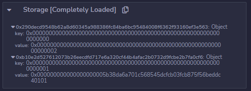
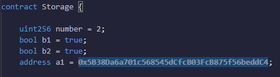

# 03 - Solidity 201

**Q1 Which of the following is/are true about abstract contracts and interfaces?**

A) Abstract contracts have at least one function undefined

B) Interfaces can have some functions defined

C) Unimplemented functions in abstract contracts need to be declared virtual

D) All functions are implicitly virtual in interfaces

> If a contract has at least one `virtual` function it must be defined as `abstract`, which means an inheriting contract will have to implement this function. But a contract can be declared abstract and not having a virtual function.
Interfaces are another type of contract, they can be seen as header files in C. Functions are not defined, but their prototype is, making it easier to interact with an already deployed contract. rather than using `call()`. For this, a deployed contract address can be casted using the interface, giving the developer access to the declared method in the interface. 
Also good to not, functions in interfaces can be overriden (they are implicitly `virtual`)
[Solidity doc reference](https://docs.soliditylang.org/en/v0.6.2/contracts.html#abstract-contracts)
> 

---

**Q2 Libraries are contracts**

A) That cannot have state variables

B) That cannot be inherited

C) That always require a delegatecall

D) That are not meant to receive Ether

> Libraries are meant to be used with `delegatecall` , because of the nature of this call (executing in the caller storage context), they shouldn’t and cannot (compiler error) have non constant state variables as this could lead to unexpected results in caller.
This make the use of `constant` variable possible as they are hardcoded in bytecode, and same for `memory` variables.
Libraries cannot be inherited, this is not what they are made for. But they can be imported, and then library functions can be called like you would call a function from a contract ( `Lib.func()`)
Finally, library functions cannot be `payable`
[Solidity doc reference](https://docs.soliditylang.org/en/v0.6.2/contracts.html#libraries)
> 

---

**Q3 Storage layout**

A) Refers to the layout of state variables in storage

B) Is organized in 256-byte slots

C) Is packed for value types that use less than 32 bytes

D) Always starts on a new slot for reference types

> Everything is present in the first part of this [doc](https://docs.soliditylang.org/en/v0.8.17/internals/layout_in_storage.html)
Details on why references types are stored in a new slot [here](https://docs.soliditylang.org/en/v0.8.17/internals/layout_in_storage.html#mappings-and-dynamic-arrays) 
But to make it simple, as dynamic variables have unpredictable size, they cannot be stored in a packed way, the values they reference to are stored in a data location calculated using [the hash of the slot + other values], where the reference object is stored. If 2 different dynamic variables were stored in a same slot, there’s a possibility that [the hash of their slot + other values] are the same, thus implying the values they references to will overlap
> 

---

**Q4 For contract A {uint256 i; bool b1; bool b2; address a1;} the number of storage slots used is**

A) 4

B) 3

C) 2

D) 1

> Variables are packed in [32-bytes wide](https://docs.soliditylang.org/en/v0.8.17/internals/layout_in_storage.html) (or 256-bits) slots. This means `i` will take 1 slot for himself first. Adresses take 20-bytes, and for bool, well, I had to check by myself as I couldn’t find the answer, and seems they take 2-bytes as shown by these Remix screenshot I took (we see 2 storages slots, and we can see the values in there) :
> 
> 
> 
> 
> 
> 

---

**Q5 Which of the following is/are generally true about storage layouts?**

A) The number of slots used for a contract depends on the ordering of state variable declarations

B) The slots for struct elements are consecutive

C) The slot s for dynamic array contains the length with individual elements stored consecutively in slots starting at keccak256(s)

D) The slot s for mapping is empty with individual values stored consecutively in slots starting at keccak(h(k).s), where k is the first key and h is a hash function that depends on type of k

> Slots are 32-bytes wide, and variables are packed following [this rule](https://docs.soliditylang.org/en/v0.8.17/internals/layout_in_storage.html), so state variable ordering is important to optimize storage size, thus gas usage when deploying the contract.
Struct elements always starts a new slot, and their items are packed accordingly to the storage rules.
Rules for dynamic arrays and mappings are [here](https://docs.soliditylang.org/en/v0.8.17/internals/layout_in_storage.html#mappings-and-dynamic-arrays)
> 

---

**Q6 EVM memory**

A) Is linear and byte-addressable

B) Is reserved by Solidity until 0x7f

C) Can be accessed in bytes using MLOAD8/MSTORE8

D) Is non-volatile or persistent

> A linear memory model refers to a memory organized in a single contiguous address space, which is the case for EVM, where each elements are uint8 (its a byte array under the hood) Elements can be stored in 32 bytes or 1 byte chunks, but only read in 32 bytes chunks.
> 
> 
> Solidity’s memory layout reserves four 32-byte slots:
> 
> 0x00 - 0x3f (64 bytes): scratch space
> 
> 0x40 - 0x5f (32 bytes): free memory pointer
> 
> 0x60 - 0x7f (32 bytes): zero slot
> 
> Memory is temporary place used during function calls and only persist during the call
> 

---

**Q7 EVM inline assembly has**

A) Its own language called Yul

B) Safety checks just like Solidity

C) Access to all variables in the contract and function where present

D) References to variables as their addresses not values

> When there’s need to optimize a portion of code, inline assembly must be used. Its language is called Yul, and must be written inside this block : `assembly { ... }` .
This is a low level language close to the EVM opcodes, hence it should be use with caution as no safety guard are present.
It is possible to access to any variable in the contract as described [in the doc](https://docs.soliditylang.org/en/v0.8.17/assembly.html)
Depending on the type of the variable, the evaluated value can either be the variable value or its address
> 

---
**Q8 Zero address check is typically recommended because**

A) The use of zero address for transfers will trigger an EVM exception

B) Ether/tokens sent to zero address will be inaccessible

C) Ether/tokens sent to zero address can be accessed by anyone

D) Address 0 is the Ethereum Masternode account and is forbidden for access

> Address zero must be checked because because any tokens or ETH sent to that address will be lost. This is error could occur either because :
>- a contract interacting with the tokens fails to correctly fill the parameter
>- a user fails when typing the address in the UI
>- a front app fails to correctly fill the parameter
If anybody get the private key to that address, no question [he will be rich](https://etherscan.io/address/0x0000000000000000000000000000000000000000) ! (good luck though)
> 

---

**Q9 ERC20 transferFrom(address sender, address recipient, uint256 amount) (that follows the ERC20 spec strictly)**

A) Transfers token amount from sender to recipient

B) sender must have given caller (msg.sender) approval for at least amount or more

C) Deducts amount from sender’s allowance

D) Deducts amount from caller’s (msg.sender’s) allowance

> transferFrom is called by a caller, to transfer tokens on behalf of sender, to the recipient. For this to be possible, sender must have approved the caller at least for the amount the caller wants to transfer. Once amount is transfered, the allowance of the caller in regard to the sender is reduced by the amount.
> 

---

**Q10 OpenZeppelin SafeERC20 is generally considered safer to use than ERC20 because**

A) It adds integer overflow/underflow checks

B) It adds return value/data checks

C) It adds pause/unpause capability

D) It adds race-condition checks

> SafeERC20 is a wrapper around ERC20 functions (for example {SafeERC20.SafeTransfer} is wrapped around {ERC20.transfer}) and makes sure that :
(1). the call reverts if the function return false
(2). calls is successful for function no returning values (if not using SafeERC20 this could lead to a revert if not handled properly)
[contract here](https://github.com/OpenZeppelin/openzeppelin-contracts/blob/master/contracts/token/ERC20/utils/SafeERC20.sol)
>
---

**Q11 OpenZeppelin ERC20Pausable**

A) Adds ability to pause token transfers

B) Adds ability to pause token minting and burning

C) Provides modifiers whenPaused and whenNotPaused

D) None of the above

> OpenZeppelin ERC20Pausable add some sort of security layer that allow authorized addresses (this can be the owner, or specific roles if conbined with [AccessControl](https://docs.openzeppelin.com/contracts/4.x/api/access#AccessControl) module) to pause and unpause any function of the contract, as far as these function have the `whenPause` and `whenNotPaused` modifier
>

---

**Q12 OpenZeppelin ERC721**

A) Implements the NFT standard
B) safeTransferFrom(..) checks for zero-addresses
C) approve(..) is susceptible to race-condition just like ERC20
D) setApprovalForAll(address operator, bool _approved) approves/removes operator for all of caller’s tokens

---

**Q13 ERC777 may be considered as an improved version of ERC20 because**

A) Hooks allow reacting to token mint/burn/transfer
B) It can help avoid separate approve and transferFrom transactions
C) It can help prevent tokens getting stuck in contracts
D) It removes reentrancy risk

---

**Q14 The OpenZeppelin library that provides onlyOwner modifier**

A) Is Ownable
B) Provides role based access control
C) Provides a function to renounce ownership
D) None of the above

---

**Q15 OpenZeppelin’s (role-based) AccessControl library**

A) Provides support only for two specific roles: Owner and User
B) Provides support for different roles with different authorization levels
C) Provides support for granting and revoking roles
D) None the above

---

**Q16 If OpenZeppelin’s isContract(address) returns false for an address then**

A) Address is guaranteed to not be a contract
B) Codesize at address is 0 at time of invocation
C) Both A & B
D) Neither A nor B

---

**Q17 CREATE2**

A) Deploys two contracts proxy and implementation concurrently
B) Deploys contract at an address that can be predetermined
C) Uses a salt and contract creationCode
D) None of the above

---

**Q18 OpenZeppelin ECDSA**

A) Implements functions for signature creation & verification
B) Is susceptible to signature malleability
C) Both A & B
D) Neither A nor B

---

**Q19 OpenZeppelin SafeMath**

A) Prevents integer overflows/underflows at compile-time
B) Is not required if using Solidity compiler version >= 0.8.0
C) Both A & B
D) Neither A nor B

---

**Q20 OpenZeppelin’s proxy implementations**

A) Typically have a proxy contract and an implementation contract
B) Use delegatecall's from proxy to implementation
C) Cannot support upgradeable proxies
D) None of the above

---

**Q21 Proxied contracts**

A) Should use constructors in implementation contract to initialize the proxy’s state variables
B) Should use an external/public initialize() function
C) Should have their initialize() function called only once
D) All of the above

---

**Q22 Dappsys provides**

A) A proxy implementation
B) A floating-point implementation with wad & ray
C) A flexible authorization implementation
D) All of the above

---

**Q23 WETH is**

A) An ERC20 pre-compile for Wrapped Ether built into Ethereum protocol
B) Warp Ether for super-fast Ether transfers
C) Wrapped Ether to convert Ether into an ERC721 NFT
D) None of the above

---

**Q24 Name collision error with inheritance happens when the following pairs have the same name within a contract**

A) Function & modifier
B) Function & event
C) Function & function
D) Event & modifier

---

**Q25 Which of the following is/are not allowed?**

A) Function overriding
B) Function overloading
C) Modifier overloading
D) Modifier overriding

---

**Q26 Solidity supports**

A) Multiple inheritance
B) Polymorphism
C) Contract overloading
D) Function overloading

---

**Q27 Which of the following EVM instruction(s) do(es) not touch EVM storage?**

A) SLOAD
B) MSTORE8
C) SSTORE
D) SWAP

---

**Q28 Which of the following is/are true about Solidity compiler 0.8.0?**

A) ABI coder v2 is made the default
B) No opt-out primitives for default checked arithmetic
C) Failing assert returns the gas left instead of consuming all gas
D) Exponentiation is made right associative

---

**Q29 OpenZeppelin SafeCast**

A) Prevents underflows while downcasting
B) Prevents overflows while downcasting
C) Prevents underflows while upcasting
D) Prevents overflows while upcasting

---

**Q30 OpenZeppelin’s ReentrancyGuard library mitigates reentrancy risk in a contract**

A) For all its functions by simply deriving/inheriting from it
B) Only for functions that apply the nonReentrant modifier
C) By enforcing a checks-effects-interactions pattern in its functions
D) None of the above

---

**Q31 Assuming all contracts C1, C2 and C3 define explicit constructors in contract C1 is C2, C3 {…} and both C2 and C3 don’t inherit contracts, the number & order of constructor(s) executed is/are**

A) One, that of C1
B) Three, in the order C2, C3, C1
C) One, that of C3
D) Three, in the order C1, C2, C3

---

**Q32 Which of the following is/are true for a function f that has a modifier m?**

A) Function f cannot have another modifier because every function can have at most one modifier
B) Function f's code is inlined at the point of _ within modifier m
C) Function f reverts if _ is not executed in the modifier m
D) None of the above